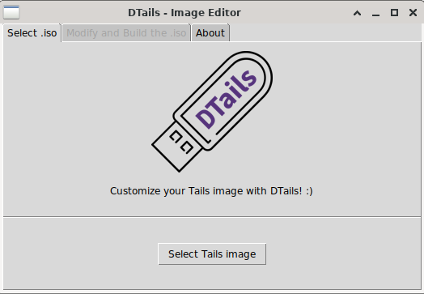
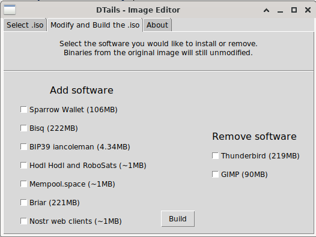

<p align="center">
    
</p>
<h1 align="center">DTails</h1>

<p align="center">
  <a href="https://opensource.org/licenses/MIT" title="License: MIT">
    
  </a>
  <a href="https://twitter.com/DesobedienteTec" title="Twitter">
  
  </a>
  <a href="lnurlp:dt@getalby.com" title="Lightning">
  
  </a>
  <a href="http://btcpay.desobedientetecnologico.com/" title="Bitcoin / BIP47">
  
  </a>
  
</p>


# ℹ️ About

DTails is a tool to add software in Debian based live images like Tails. DTails is not a distribution.

## 📦 Packages requirements

```bash
sudo apt-get install binwalk genisoimage live-boot squashfs-tools build-essential
```

And Python packages for the GUI:
```bash
pip install tk
```

## 🛠 Getting started
Clone the repository with:

```bash
git clone https://github.com/DesobedienteTecnologico/dtails
```

Once you have clone the repository and you get inside the directory. Run this to start the GUI:


```bash
sudo python dtails.py
```

#### Why sudo?
Sudo is needed to mount the <b>.iso / .img</b> into a directory, as well to use other software. Without it, we can't use those GNU/Linux tools.

### 1. 💿 Select the Tails .iso



### 2. 📥 / 📤 Add or remove packages
 1. Click on the checkboxes to add (Left) or remove (Right) the software you like.
 2. Click on "Build" once you are ready to build your image.



You can keep track in that is happening in your terminal.


### 3. 💽 That was all! :)
You will get a dtails.iso image just in the same directory you run the GUI.

## DEMO


