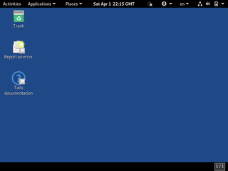

<p align="center">
    
</p>
<h1 align="center">DTails</h1>

<p align="center">
  <a href="https://opensource.org/licenses/MIT" title="License: MIT">
    
  </a>
  <a href="https://twitter.com/DesobedienteTec" title="Twitter">
  
  </a>
  <a href="lnurlp:dt@getalby.com" title="Lightning">
  
  </a>
  <a href="http://btcpay.desobedientetecnologico.com/" title="Bitcoin / BIP47">
  
  </a>
  
</p>


# ℹ️ About

DTails is a tool to add software in Debian based live images like Tails. DTails is not a distribution.

## 📦 Packages requirements

```bash
sudo apt-get install genisoimage parted squashfs-tools syslinux-utils build-essential python3-tk python3-pil.imagetk python3-pyudev
```

## 🛠 Getting started
Clone the repository with:

```bash
git clone https://github.com/DesobedienteTecnologico/dtails
```

Once you have clone the repository and you get inside the directory. Run this to start the GUI:


```bash
sudo ./dtails.py
```

#### Why sudo?
Sudo is needed to mount the <b>.iso / .img</b> into a directory, as well to use other software. Without it, we can't use those GNU/Linux tools.

### 1. 💿 Select the Tails .iso


### 2. 📥 / 📤 Add or remove packages
 1. Click on the checkboxes to add (Left) or remove (Right) the software you like.
 2. Click on "Build" once you are ready to build your image.


You can keep track in that is happening in your terminal.


### 3. 💽 .iso vs .img
**❌ Persistence:** If you choose **.iso** image you will build an **DTail.iso** image in the same DTails directory.

**✅ Persistence:** In case you choose **.img**, you will be redirected to the 3º tab where you can choose the flash drive to install your modified OS into it.


Connect your flash drive and choose the right one. (Double check it once you select it!)


## DEMO


